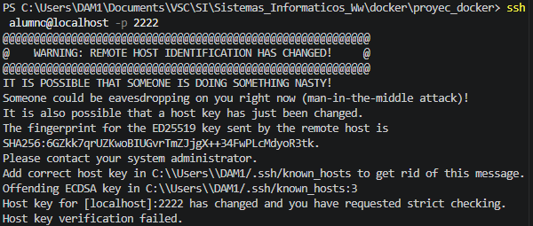

# Bitacora 4
## Preparación del Entorno
**Tarea 1: Despliegue de la Infraestructura**
Guardo el archivo docker-compose-copia.yml (aunque no es el que esta corriendo, que esta en la carpeta proyec_docker).
Abro la terminal dentro la carpeta que tengo el archivo proyec_docker.yml y ejecuto: *docker-compose up -d*
Verifico que los contenedores están corriendo con *docker ps*. Debería ver un servidor de consola (SSH) y uno gráfico (Webtop/RDP).
## Fase de Ejecución
**SSH: Forjando la Llave Maestra**
Paso A (Conexión Inicial): Conéctarme al contenedor usando *ssh alumno@127.0.0.1 -p 2222*. La contraseña es *sistemas_informaticos*.
Paso B (Generación de Identidad): En tu máquina anfitriona, genera un par de llaves: *ssh-keygen -t ed25519 -C "jorgeespejo.25@campuscamara.es"*
Paso C (Transferencia): Copio mi llave pública al servidor. Puedo usar *ssh-copy-id -p 2222 alumno@127.0.0.1* o hacerlo manualmente pegando el contenido en *~/.ssh/authorized_keys* dentro del contenedor.
## Capturas Críticas
Captura de la conexión SSH sin contraseña.

## Errores 
En la parte del paso A al poner el comando *ssh alumno@127.0.0.1 -p 2222*, me sale el siguiente error

Se soluciona poniendo la ip del dispositivo (127.0.0.1) en vez de localhost